# pice_demo

A Flutter prototype for Android and iOS that explores three feature additions to **[Pice](https://piceapp.com)** — India's B2B payments app for GST-registered businesses. Theme and design language lifted from the live app; data, navigation, and state are local mocks.

<p align="center">
  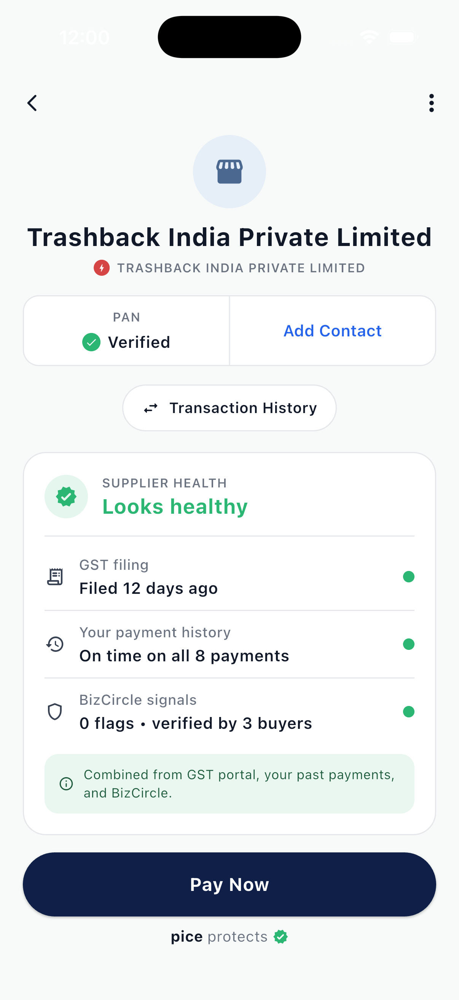
  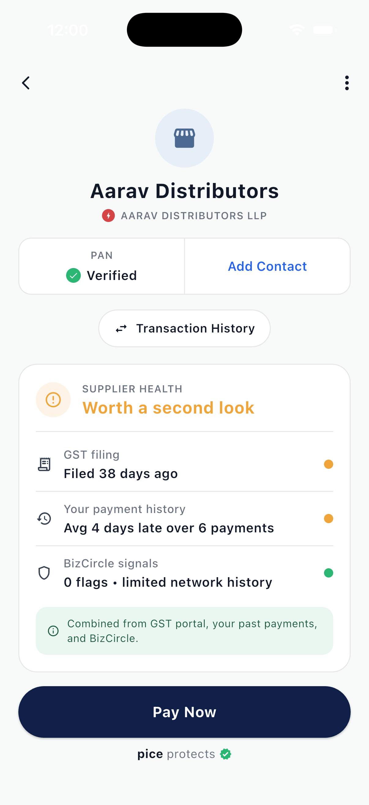
  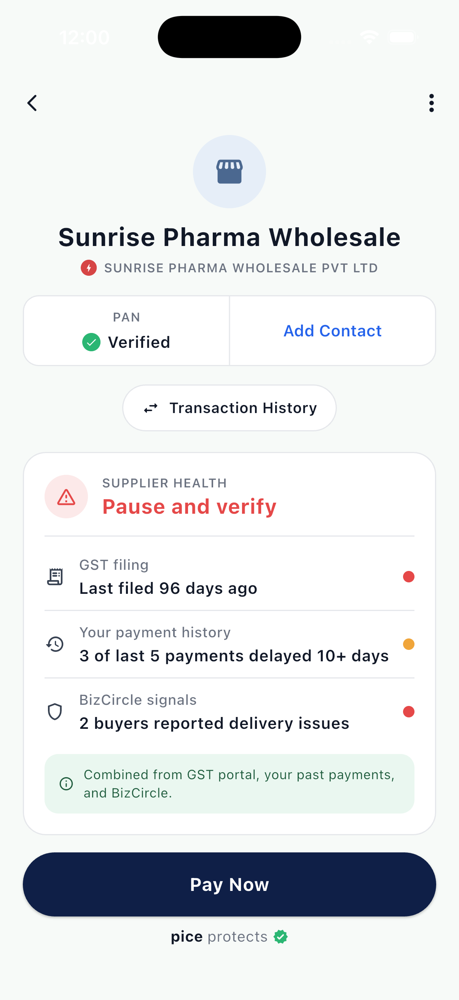
</p>

> **Why this exists.** Pice already owns three trust-relevant data assets — GST portal imports, your own payment ledger, and BizCircle — but they live in different parts of the app and rarely meet at the moment of decision. This prototype connects them, and adds two more surfaces around the payment moment: a first-class **Disputed** state for invoices, and **WhatsApp-native payment requests** so suppliers can collect through the channel they already use.

The accompanying feature proposal lives at `Pice_Feature_Proposals.pdf` on the project owner's desktop and on request.

---

## Features

### 1. Supplier Health Score — pre-payment intelligence card

A traffic-light card on the merchant detail screen that combines **GST filing recency**, **your payment history with this supplier**, and **BizCircle network signals** into a single rolled-up verdict — *Looks healthy* (green) / *Worth a second look* (amber) / *Pause and verify* (red). Quiet context at the moment that matters, never a hard block.

For risky suppliers, tapping **Pay Now** triggers a one-tap "Heads up" confirmation; healthy and watch both proceed normally.

| Healthy | Watch | At risk |
| :---: | :---: | :---: |
|  |  |  |

**Code**: [`lib/widgets/supplier_health_card.dart`](lib/widgets/supplier_health_card.dart), [`lib/screens/merchant_detail_screen.dart`](lib/screens/merchant_detail_screen.dart), [`lib/models/supplier.dart`](lib/models/supplier.dart)

### 2. Dispute & Hold Flag on Invoices — a third payment state

Today an invoice in Pice is either pending or paid. This adds **Disputed** as a first-class state: mark an invoice disputed with a short note, optionally notify the supplier through Pice, and the invoice moves to a separate **Disputed** tab — visible without cluttering the Pending queue. From a disputed invoice you can **Mark as Paid** (once resolved) or **Clear Dispute** (back to Pending).

Live count badge on the AppBar's receipt icon updates as you flag and clear. Backed by a small `ChangeNotifier` repository so all surfaces stay in sync.

| Invoices list | Pending invoice | Flag as disputed | Disputed invoice |
| :---: | :---: | :---: | :---: |
| 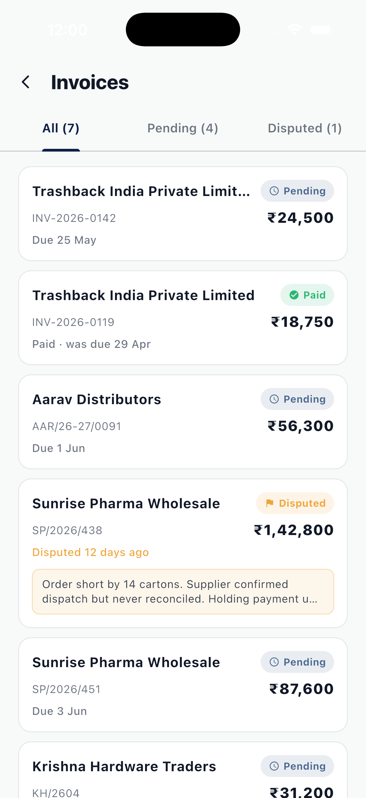 | 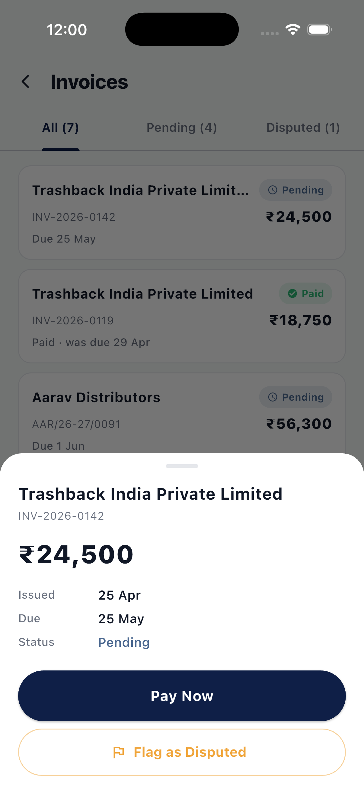 | 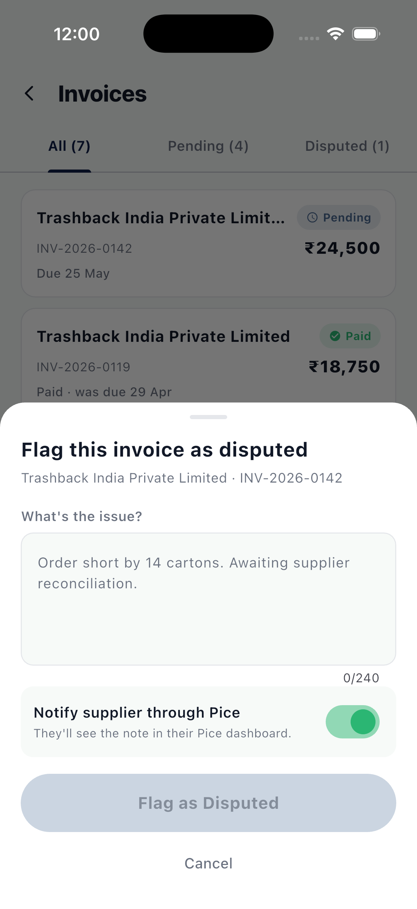 | 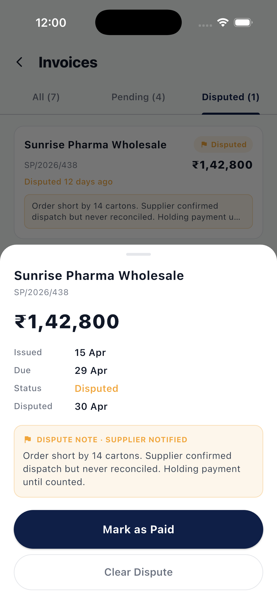 |

**Code**: [`lib/screens/invoices_screen.dart`](lib/screens/invoices_screen.dart), [`lib/widgets/dispute_invoice_sheet.dart`](lib/widgets/dispute_invoice_sheet.dart), [`lib/widgets/invoice_detail_sheet.dart`](lib/widgets/invoice_detail_sheet.dart), [`lib/services/invoice_repository.dart`](lib/services/invoice_repository.dart)

### 3. WhatsApp-Native Payment Requests — collect over the channel SMEs already use

A floating **Request** action (QR icon, navy) opens a sender form: amount with ₹ prefix, optional invoice number, optional due date, optional note. Generating creates a signed deep link of the form `https://pice.app/pay?ref=...&amt=...&from=...&gst=...&inv=...&due=...&note=...` and a share screen with three actions:

- **Share on WhatsApp** — opens `https://wa.me/?text=...` via `url_launcher` with a pre-composed message + link
- **Copy Link** — to clipboard, with confirmation toast
- **Preview as buyer** — opens the receiver-side screen so the buyer flow is demoable on a single device

The buyer-side `IncomingPaymentScreen` mirrors what opens when the link is tapped from WhatsApp: a green "Opened from WhatsApp link" pill, hero card with amount + verified business + GSTIN, an info card with invoice / due / reference, the sender's note, and a one-tap **Pay via Pice** CTA.

`PaymentRequest.tryParse(url)` reverses both `https://pice.app/pay?...` and `pice://pay?...` back into the model — drop in `app_links` + manifest entries for real link reception.

| Request form | Share request | Buyer view |
| :---: | :---: | :---: |
| 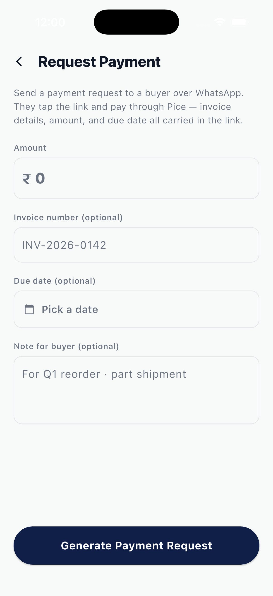 | 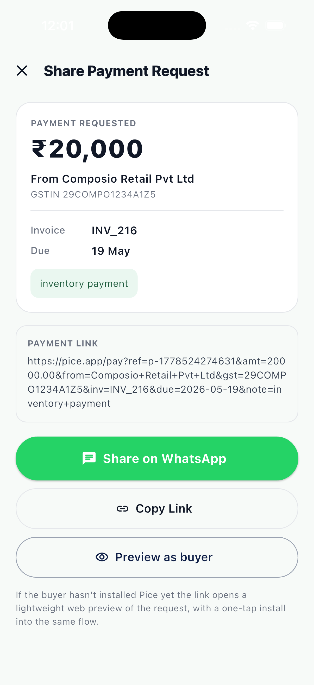 | 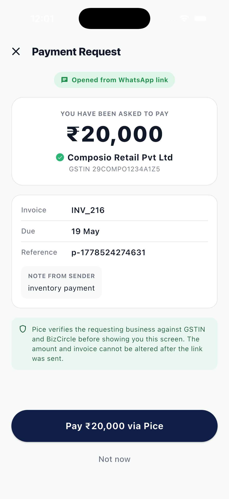 |

**Code**: [`lib/models/payment_request.dart`](lib/models/payment_request.dart), [`lib/screens/request_payment_screen.dart`](lib/screens/request_payment_screen.dart), [`lib/screens/payment_request_share_screen.dart`](lib/screens/payment_request_share_screen.dart), [`lib/screens/incoming_payment_screen.dart`](lib/screens/incoming_payment_screen.dart)

---

## Run

```bash
flutter pub get
flutter run
```

If `ios/` or `android/` look incomplete, regenerate the native build files once:

```bash
flutter create --platforms=android,ios --org com.example .
```

## Demo flow

<p align="left">
  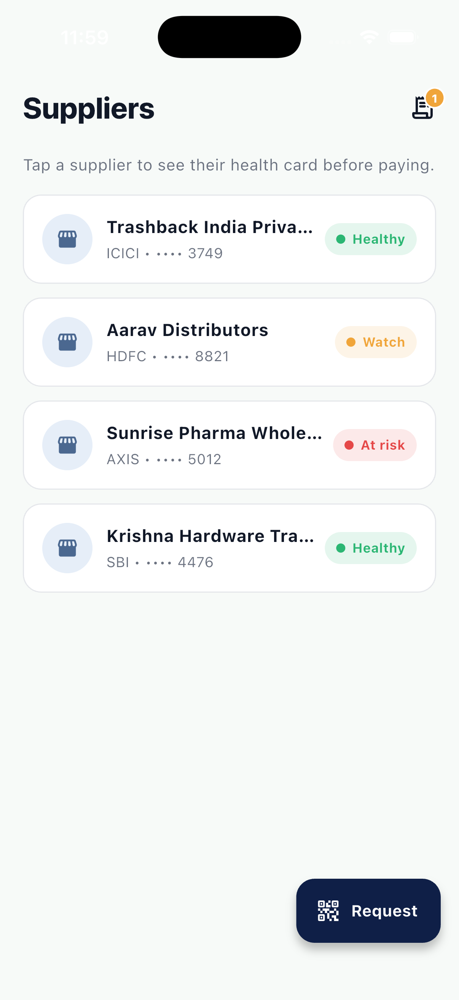
</p>

1. **Home → Suppliers.** Notice the amber `1` badge on the receipt icon and the navy "Request" FAB. Tap *Sunrise Pharma Wholesale* (red chip) to see the health card surface "Pause and verify" before payment.
2. **AppBar → receipt icon.** Open the **Disputed** tab — Sunrise's overdue invoice is already disputed in the seed data. Tap to see the note, the supplier-notified indicator, and **Mark as Paid** / **Clear Dispute** actions.
3. **Back to home → "Request" FAB.** Fill an amount and invoice number, tap **Generate**, then **Preview as buyer** to see what arrives in the buyer's Pice when they tap the WhatsApp link.

<br clear="all"/>

## Tech stack

- **Flutter 3.19+** with Material 3.
- **State**: in-memory `ChangeNotifier` repository for invoices; immutable models for suppliers and payment requests.
- **Dependencies**: `url_launcher` for WhatsApp share-intent. No other third-party packages — everything else is built on Flutter SDK widgets.
- **Theme**: navy `#0F1F47` primary, mint accents, stadium pill buttons — lifted from screenshots of the live Pice app.

## Project layout

```
pice_demo/
├── pubspec.yaml
├── analysis_options.yaml
├── lib/
│   ├── main.dart
│   ├── theme/pice_theme.dart
│   ├── models/
│   │   ├── supplier.dart
│   │   ├── invoice.dart
│   │   └── payment_request.dart
│   ├── data/
│   │   ├── mock_suppliers.dart
│   │   └── mock_invoices.dart
│   ├── services/
│   │   └── invoice_repository.dart
│   ├── utils/
│   │   └── format.dart            # Indian ₹ + date helpers
│   ├── screens/
│   │   ├── supplier_list_screen.dart
│   │   ├── merchant_detail_screen.dart
│   │   ├── invoices_screen.dart
│   │   ├── request_payment_screen.dart
│   │   ├── payment_request_share_screen.dart
│   │   └── incoming_payment_screen.dart
│   └── widgets/
│       ├── health_signal_row.dart
│       ├── supplier_health_card.dart
│       ├── invoice_tile.dart
│       ├── invoice_detail_sheet.dart
│       └── dispute_invoice_sheet.dart
├── test/widget_test.dart
├── docs/                          # README screenshots
├── android/
└── ios/
```

## Notes for a production implementation

- Health Score needs a small server endpoint that joins the GST imports, the user's payment ledger, and BizCircle flags by GSTIN, then runs a simple rules engine (filing recency thresholds, avg payment delay bands, flag-count tiers) and returns `{verdict, signals[]}`. The widget already consumes that shape.
- Dispute state needs the existing invoice schema extended with `status`, `dispute_note`, `disputed_at`, `notified_supplier` columns plus an audit trail. The repository in this demo maps one-to-one to those fields.
- WhatsApp payment links need (a) Android intent filter + iOS `CFBundleURLTypes` for `pice://pay`, (b) Associated Domains + `apple-app-site-association` for `https://pice.app/pay`, and (c) the `app_links` package listening for incoming URIs and calling `PaymentRequest.tryParse(url)`.

## Not in scope

- Real payment / settlement.
- Real authentication, KYC, or backend.
- Animations, haptics, or accessibility audit beyond Material defaults.

---

Built as a portfolio piece, not affiliated with Pice. All product names, logos, and brand colours referenced are property of their respective owners.
